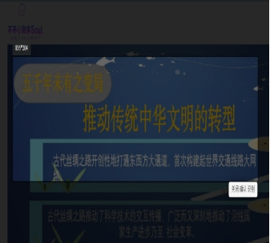
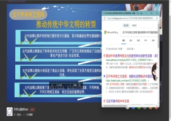
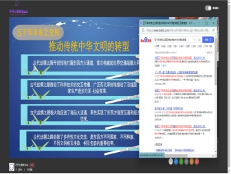
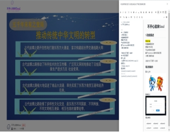
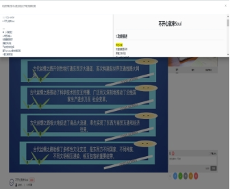
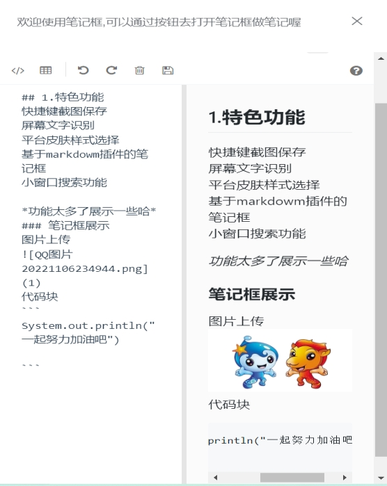
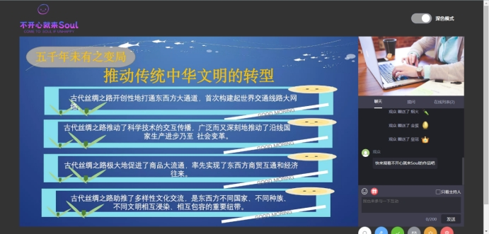
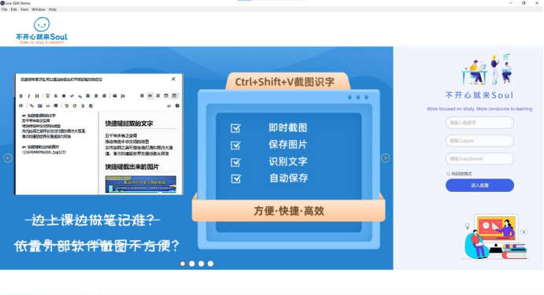

## ”直播+升级小课堂”软件设计作品方案

### 一、设计背景

新冠疫情席卷全球达三年之久，城市封控、线上授课已成常态。随之兴起的在线直播课堂成为广大教师和学生进军的主战场。而优化学生体验、提升教学质量、降低疫情等原因对教育事业的影响度是各大直播软件不断更新换代、升级完善的最终目标。

 

### 二、设计目的

通过对比分析线下线上教学方式的差异性，从学生端的角度出发，通过改良直播平台现有的功能以及针对观看直播过程中笔记记录、疑难搜索、小组讨论等方面进行创新设计，力求高度还原线下课堂教学场景，提升学生在线上课的便利性与舒适度，从而保证教学效果、提升教学质量。

 

### 三、设计内容

#### 1、基础功能：

①聊天框：欢迎语、点赞、送礼、送花、聊天信息、只看主持人、设置昵称、连接超时提醒、在线列表、提问、打赏等功能    

②播放器：音量设置、暂停/恢复播放、切换倍速、关闭或显示讲师摄像头、切换当前线路  PPT翻页、发送弹幕、隐藏/恢复弹幕、切换清晰度(需支持多码率)、支持回放          无延迟播放、连麦等功能    

③互动功能：公告、 签到、 答题卡、 问卷、 抽奖、 卡片推送、条件抽奖等功能          

 

#### 2、创新亮点：

##### ①【快捷键ctr+shift+v截取屏幕】

**优势**：

​       克服了当今学生网课中截图保存操作复杂、截图借助外部软件接触屏幕不方便以及难以及时获取授课人的课程笔记等等问题，本产品提供了附加于直播观看页面的快捷键截图功能，可以随时地无限地地通过ctr+shift+v进行直播画面截取，方便、快捷且高效。

**实现**：

 

|  )|  |
| ------------------- | ------------------- |
|                     |                     |

 

##### ②【识别并提取屏幕文字】

**优势**：

为了解决当代大学生文档记录速度过慢难以赶上授课人PPT切换速度、遇到授课人推荐的学习网页链接难以及时获取且多数时候要盯着屏幕手动记录网站不方便等问题，本产品提供给了快捷键ctr+shift+v截取画面并进行文字识别和提取的功能，提高学习记录和知识点提取的效率。

**实现**：

| |  |
| ------------------- | ------------------- |
|                     |                     |

 

##### ③【小窗口实时搜索】

**优势**：

解决了学生听课过程中因某些知识漏洞、知识盲区以及扩展知识而影响听课效果的问题，在无法打断讲师授课、提出自身疑问的情况下，采取关键词即使联网搜索的方式，短时间内帮助学生了解相关概念或者技术原理，快速跟进讲师授课进度，达到知识链条环环相扣、知识结构稳扎稳打的目的，本产品提供了一键打开浏览器选择器，选择喜欢的浏览器，浏览器自动进行小窗口打开供用户搜索实验，小窗口不阻碍直播画面的观看，也无需用户离开直播页面寻找查找网站，方便快捷地进行实时搜索。

**实现**：

| ***\*\**** | ***\*\**** |
| ----------------------------- | ----------------------------- |
| ***\*\**** | ***\*\**** |

 

##### ④【基于Markdowm插件笔记框】

**优势**：

为了解决依靠外部软件做笔记带来的流程复杂，难以跟上讲课进度、错过重要学习、后期整理时间赘余以及额外打开其他做笔记的软件出现的页面堆叠导致做笔记体验差、影响学习效率等一系列的缺点，本产品提供了基于Markdown插件的具有强大功能的笔记框给用户进行笔记记录，笔记框可以选择在直播页面的打开的位置（可设置默认打开位置），同时给用户提供了文字颜色、图片上传、序号标记、代码块、HTML模式编写、全屏查看等多项功能，便于学生在观看直播过程中随时随地随心所欲地根据自身知识掌握程度以及听课效果甄选保存具有个人风格的笔记。

**实现**：

|           |  |
| ---------------------------- | -------------------- |
| ******** |                      |

 

 

 

##### ⑤【用户页面风格切换】

**优势**：

避免单一页面风格造成学生听课效率欠佳、知识吸收不畅的情况，通过设计不同颜色、样式的页面风格供给学生自由选择切换，满足学生个人偏好，减少使用软件直播过程中乏味单调、倦怠无趣等负面情绪以及较暗光线下观看直播给学生眼睛带来的伤害，最大程度提高学生舒适感与愉悦程度，本产品提供了一键换肤功能，提供了白天和夜晚两种模式，用户可以根据个人喜好自行切换页面的模式。

**实现**：

 

| ***\*\**** |
| ------------------------------ |
| ********   |

 

##### ⑥【登录页展示作品特色功能】

**优势**：

为了彰显产品特色，团队根据自身特色自行设计了产品logo、产品特色功能展示海报，并利用轮播图进行循环展示，让用户能够准确地、更便捷地了解到本产品的特色，整个页面的样式清新、别致，更加符合广大学生的品味，迎合他们的需求，达到很好的宣传和品牌打造等作用。

**实现**：

***\*\**** 

 

 

#### 2、开放中的功能：

***\*①\****基于Markdown的笔记内容的导出功能，提供Word、PDF等多种格式的导出

***\*②\****对产品使用问题的一键实时反馈

***\*③\****对授课人提供的学习网站进行一键收藏

***\*④\****直播软件的页面样式设计权限下发用户

### 四、团队分工

| **时间** | **人员** | ***负责内容***                                               |
| -------- | -------- | ------------------------------------------------------------ |
| 前期     | 李宏基   | 安排个人任务、制定工作计划、参与成员各项工作                 |
|          | 李津津   | 直播软件项目基本构成学习                                     |
|          | 张孙文   | 直播软件功能分析、前端页面学习                               |
|          | 郑彤敏   | 直播软件项目基本构成学习                                     |
| 中期     | 李宏基   | 确定直播主题方案、分配任务，直播软件中的md笔记框、截图、识字设计和开发 |
|          | 李津津   | 前端页面样式设计，页面图片、字体等样式设计，页面布局设计     |
|          | 张孙文   | 直播软件中的工具栏、笔记框、页面抽屉设计和开发               |
|          | 郑彤敏   | 作品logo设计和制作，前端页面样式设计，轮播图、模式转换设计和实现，页面布局设计 |
| 后期     | 李宏基   | 拼接和汇总直播软件功能，应用测试排错，程序打包成应用，操作指南编写 |
|          | 李津津   | 制作直播软件功能展示海报，编写直播软件设计方案文档，应用测试排错 |
|          | 张孙文   | 拼接前端开发页面样式、编写直播软件设计方案文档，应用测试排错 |
|          | 郑彤敏   | 直播页面的最终设计和布置调整，及时处理修正错误页面样式和布局，应用测试排错 |

 

### 五、前景展望

#### 1.主打方向：

本产品主打观看线上授课教学直播的服务，即”直播+小课堂“服务

#### 2.背景重申：

​       近些年来，受新冠肺炎疫情的影响同时为了积极响应国家的防疫政策，线上授课已然成为了面对疫情困境最受欢迎同时也是最有效的一种应对方式，本产品基于此背景，专门打造了面向中小学生、大学生等大范围的受众，在直播软件基础功能的基础上进行了设计、创新的直播软件。

#### 3.功能综述：

​        本产品除了提供直播软件基础的聊天框、播放器、互动等方面的功能外，还创新性打造了快捷键ctr+shift+v截取屏幕、识别并提取屏幕文字、小窗口实时搜索、基于Markdowm插件笔记框、登录页展示作品特色等功能，基于一名大学生在观看直播授课遇到的各种问题，用用户的思维去考虑、设计和实现产品的功能，在丰富产品的功能的同时，增强了产品的竞争优势和市场适应性。

#### 4.后期工作：

​       基于团队的设计方案，继续完善在直播软件基础功能上打造的创新性功能，积极排bug，同时逐步设计和实现正在开放中的功能：a).基于Markdown的笔记内容的导出功能，提供Word、PDF等多种格式的导出，方便用户对笔记的及时保存、分享等操作；b).对产品使用问题的一键实时反馈，设置程序报错机制，及时捕获出程序使用时产生的错误，并实时反映给用户，用户进行一键反馈；c).对授课人提供的学习网站进行一键收藏，针对于用户对学习网站的需求，产品提供了一键收藏学习网站链接，可以连续、多次进行一键收藏，打造用户学习资源库；d)直播软件的页面样式设计权限下发用户，为了更好地迎合广大学生对线上直播授课观看的需求，产品将页面样式设计权限下发用户，让用户设计更符合自己个人喜好的页面样式，改善直播观看的体验感，真正做到”怎么好就怎么来“。

 

 

 

 
